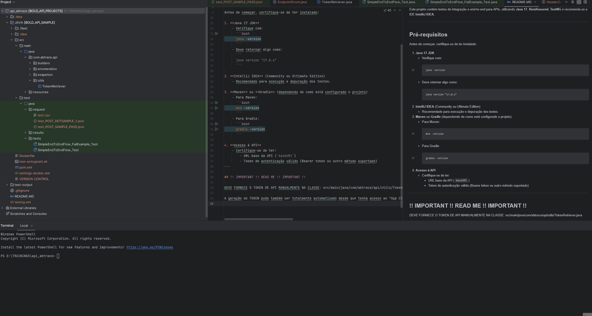

# Projeto ABTRACE TEST de API - Java 17, RestAssured & TestNG

Este projeto contém testes de integração e end-to-end para APIs, utilizando **Java 17**, **RestAssured**, **TestNG** e recomenda-se a IDE **IntelliJ IDEA**.

---

## Pré-requisitos

Antes de começar, certifique-se de ter instalado:

1. **Java 17 JDK**
    - Verifique com:
      ```bash
      java -version
      ```
    - Deve retornar algo como:
      ```
      java version "17.0.x"
      ```

2. **IntelliJ IDEA** (Community ou Ultimate Edition)
    - Recomendado para execução e depuração dos testes.

3. **Maven**
    - Para Maven:
      ```bash
      mvn -version
      ```
4. **Acesso à API**
    - Certifique-se de ter:
        - URL base da API (`baseURI`)
        - Token de autenticação válido (Bearer token ou outro método suportado)

5. **RUN TESTS**
    - Para correr os testes basta simplesmente clicar nas classes dentro de: src/test/java/tests com o botão direito e em "Run..."
    - Em CMD (certefique-se de ter o maven instalado) basta usar o comando:
    ```bash
      mvn claen test
      ```
---

## !! IMPORTANT !! READ ME !! IMPORTANT !!

DEVE FORNECE O TOKEN DE API MANUALMENTE NA CLASSE: src/main/java/com/abtrace/api/utils/TokenRetriever.java

A geração do TOKEN pode também ser totalmente automatizado desde que tenha acesso ao "App Client do Cognito" podendo passar diretamente na class "AutoTokenRetriever" em src/main/java/com/abtrace/api/utils/AutoTokenRetriever.java

## !! TEST RUN SHOW !!

